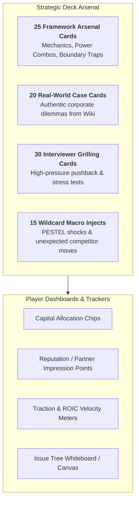
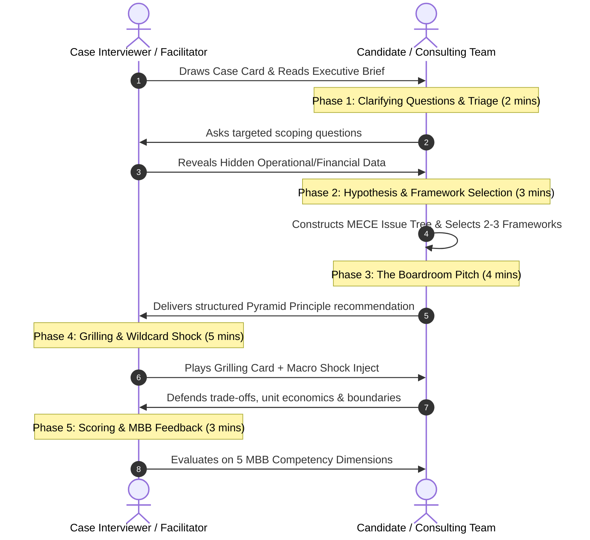
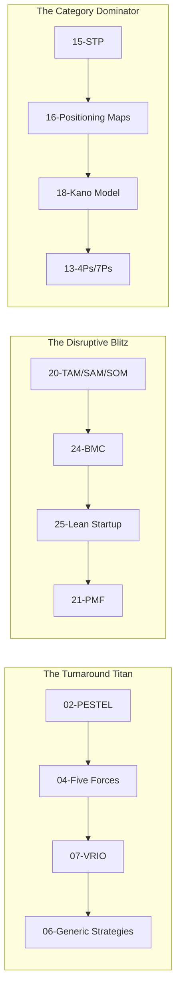

# THE STRATEGY BOARDROOM: MBA Placement War Game Manual
## *The Ultimate Interactive Strategic Decision & Interview Simulation Game*

> **Based on the Karpathy Strategic Frameworks Knowledge Base**  
> *Targeted for MBA Placement Preparation across Management Consulting (MBB/Big-4), Tech & Product Management, FMCG/Brand Management, and General Management Leadership Trainee Tracks.*

---

> [!IMPORTANT]
> **AI-GENERATED CONTENT & SIMULATION DISCLAIMER**:  
> Please note that all business case dilemmas, multiple-choice options, distractors, and consultant debrief rationales featured in **The Strategy Boardroom** are **AI-generated**. They have been algorithmically synthesized using generative artificial intelligence based on canonical business strategy frameworks (Karpathy Strategic Frameworks Knowledge Base) and empirical management literature.  
> These materials are engineered strictly for **educational training, mock case interview simulations, and pedagogical stress-testing**. Company names and real-world brand situations are used solely as illustrative decision-making contexts.

## 🎯 Executive Summary & Pedagogical Purpose

In elite MBA placement interviews, recruiters from top-tier management consulting firms (McKinsey & Co., Boston Consulting Group, Bain & Co., Strategy&, Kearney), tech giants (Google, Microsoft, Amazon, Uber), FMCG conglomerates (HUL, P&G, ITC), and leadership programs (TAS, ABG GMC, Mahindra GMC) do not look for memorized definitions. They test **structured problem solving, business acumen under ambiguity, hypothesis-driven issue tree construction, and the ability to defend strategic trade-offs under aggressive grilling.**

**THE STRATEGY BOARDROOM** transforms theoretical strategic frameworks into an interactive, high-stakes, competitive simulation game. Players take on the roles of **Management Consultants, C-Suite Executives, and Venture Founders** navigating real-world corporate dilemmas, allocating scarce capital, executing framework power-combos, and surviving intense interviewer pushback.

---

## 🏛️ Game Overview & Core Specifications

- **Target Audience**: MBA students, Strategy & Consulting Club members, Product Management aspirants, Corporate Strategy analysts.
- **Player Count**:
  - **Duel Mode (1 vs 1)**: Candidate vs. MBB Partner Interviewer (Turn-based role reversal).
  - **War Room Mode (3 to 6 Teams / Players)**: Competing corporate divisions or consulting teams.
  - **Solo Gauntlet Mode (1 Player + AI / Facilitator)**: Rapid-fire timed interview drill.
- **Play Time**: 45 to 90 minutes per session (15–20 minutes per case round).
- **Core Engine**: The 25 Essential Strategic Models from the **Karpathy Strategic Frameworks Knowledge Base**.

---

## 📦 Game Components & Virtual/Physical Materials

### 1. The 25 Framework Arsenal Cards
Each card represents one of the 25 models from the wiki, categorized by domain:
- **Part I: Business Strategy (12 Cards)**: RISE, PESTEL, SWOT/TOWS, Porter's Five Forces, Value Chain, Porter's Generic Strategies, VRIO, Core Competence, BCG Matrix, GE-McKinsey Matrix, Ansoff Matrix, RASCI.
- **Part II: Marketing Strategy (7 Cards)**: Marketing Mix (4Ps/7Ps), 4Cs, STP (Segmentation, Targeting, Positioning), Perceptual Maps, Product Life Cycle, Kano Model, Customer Journey & AIDA Funnel.
- **Part III: Go-To-Market Strategy (6 Cards)**: TAM/SAM/SOM, Product-Market Fit (Ellis Test), Crossing the Chasm, Diffusion of Innovations, Business Model Canvas, Lean Startup (Build-Measure-Learn).

*Card Metadata Includes*:
- **Primary Power**: What structural problem the framework unlocks.
- **Power Combo**: Bonus points for pairing with complementary frameworks.
- **Fatal Trap / Anti-Pattern**: Minus points if played when boundary conditions are violated.

### 2. The 20 High-Stakes Case Cards
Drawn directly from real corporate case studies in the Knowledge Base:
1. *The Silicon Leap (Apple M-Series vs Intel)*
2. *The Rural Distribution Blitz (HUL Project Shakti)*
3. *The Low-Cost Sky Duel (IndiGo vs Full-Service Airlines)*
4. *The Fast-Fashion Velocity Engine (Zara Supply Chain)*
5. *The Razor-Blade Disruption (Gillette vs Dollar Shave Club)*
6. *The Electric Vehicle Beachhead (Tesla Roadster to Model 3)*
7. *The FinTech Brokerage Overhaul (Zerodha vs Legacy Brokers)*
8. *The Budget Hospitality Filter (OYO TAM vs SAM Reality)*
9. *The Food Delivery Unit Economics Battle (Swiggy vs Zomato)*
10. *The Streaming Pivot (Netflix DVDs to Original Content)*
11. *The Video Conferencing Substitution (Zoom vs Airlines & Telepresence)*
12. *The Digital Telecom Disruption (Jio 4G Network & Pricing)*
13. *The Legacy Conglomerate Cash Flow Siphon (ITC Tobacco to FMCG/Hotels)*
14. *The Cloud Infrastructure Spinoff (Amazon AWS from Core E-commerce)*
15. *The Automotive Heritage White Space (Royal Enfield Leisure Motorcycling)*
16. *The Smartphone Platform War (Nokia Hardware vs Android Ecosystem)*
17. *The Post-Pandemic Fitness Demand Cliff (Peloton Lifecycle Management)*
18. *The Enterprise SaaS Chasm Crossing (Slack Glitch Gaming Pivot)*
19. *The Emergency Vaccine RACI Architecture (Pfizer-BioNTech Project Lightspeed)*
20. *The Budget Car Stigmatization Trap (Tata Nano Positioning Recovery)*

### 3. Interviewer Grilling Cards (The "Pushback Deck")
Used by the Interviewer / Facilitator to challenge the candidate during the pitch:
- *"Your TAM assumes 1% of a $50B market. Walk me through the bottom-up math from price and sales capacity."*
- *"Your generic strategy claims to be high-quality differentiation AND lowest price. How do you avoid getting stuck in the middle?"*
- *"You recommended a BCG Cash Cow harvest, but this market exhibits network effects. Why does your experience-curve logic break down here?"*
- *"You listed 5 delighter features in your Kano roadmap. Why haven't you addressed the failing must-be latency baseline?"*

---

## 🎮 Game Modes

### Mode A: The MBB Partner Case Duel (1 vs 1 Interview Mode)
- **Role**: Player 1 = Candidate (Consultant); Player 2 = MBB Partner / Case Interviewer.
- **Structure**: 20-minute timed case interview. Candidate has 4 minutes to clarify and construct an issue tree, 5 minutes to deliver the core recommendation, 5 minutes of aggressive grilling, and 3 minutes for scoring & debrief.
- **Round Reversal**: Players swap roles in Round 2 with a new case card.

### Mode B: The Boardroom War Game (3 to 6 Players / Teams)
- **Role**: Each player/team represents a competing corporate entity or consulting team in an industry.
- **Objective**: Maximize Market Share, ROIC, and Executive Reputation across 4 Fiscal Quarters.
- **Mechanics**: Players draw Case Dilemmas, bid Capital Allocation Chips, play Framework Combos, resolve Wildcard Macro Shocks, and vote on peer strategy defenses.

### Mode C: The Solo Rapid-Fire Gauntlet
- **Role**: Single candidate practicing against an AI Coach (using the Antigravity Skill) or flashcard deck.
- **Structure**: 5 rapid 3-minute prompts requiring instant framework selection, MECE structuring, and risk identification.

---

## 🔄 Turn-by-Turn Gameplay Mechanics (Phase Architecture)

---

### Phase 1: Case Briefing & Diagnostic Triage (Timebox: 2 Minutes)
1. The Interviewer draws a Case Card and reads the prompt aloud (e.g., *"IndiGo faces aggressive price competition from Tata-owned Air India while aviation fuel costs surge by 30%. How should the CEO respond?"*).
2. The Candidate must ask **2 to 3 clarifying questions** to scope:
   - The objective (Profitability, Market Share, or Cash Preservation).
   - Time horizon (Immediate turnaround vs. 3-year transformation).
   - Business model boundaries (Domestic vs. International, Fleet constraints).
3. If the questions are sharp, the Interviewer reveals **1 Hidden Clue** printed on the case card (e.g., *"IndiGo's turnaround time is 20 minutes vs industry average 45 minutes; fuel hedging is legally prohibited in this market."*).

---

### Phase 2: Hypothesis Tree & Framework Selection (Timebox: 3 Minutes)
1. The Candidate writes down an initial **Governing Hypothesis** (e.g., *"IndiGo must preserve its absolute Cost Leadership advantage by doubling down on turnaround velocity and ancillary unbundling rather than entering a full-service price war"*).
2. The Candidate selects **2 to 3 Framework Arsenal Cards** from their hand to structure the problem.
3. **Drafts a MECE (Mutually Exclusive, Collectively Exhaustive) Issue Tree** linking the frameworks.

---

### Phase 3: The Boardroom Pitch (Timebox: 4 Minutes)
The Candidate delivers their pitch following the **Pyramid Principle & RISE Architecture**:
- **Executive Summary / Recommendation**: Clear, direct, action-oriented bottom line first.
- **External & Structural Analysis**: Data-backed diagnosis using primary framework (e.g., Five Forces / PESTEL).
- **Internal Activity System / Advantage**: Defensible capability assessment (e.g., Value Chain / VRIO).
- **Go-To-Market / Tactical Execution**: Concrete levers (e.g., 4Ps, STP, RASCI governance).
- **Risks & Mitigation Trade-Offs**: Explicitly stating what the firm must *not* do.

---

### Phase 4: The Partner Grilling & Wildcard Shock (Timebox: 5 Minutes)
1. The Interviewer plays **1 Grilling Card** and **1 Wildcard Macro Inject** (e.g., *"Wildcard: Government imposes new carbon tax on single-aisle jets"*).
2. The Candidate must maintain executive poise, calculate back-of-the-envelope sanity numbers, and adapt their framework recommendations without contradicting their core hypothesis.
3. The Interviewer tests the Candidate for **Framework Boundary Traps** (e.g., checking if the candidate tried to use BCG matrix logic on a non-experience-curve business).

---

### Phase 5: Scoring, Evaluation & Debrief (Timebox: 3 Minutes)
The Interviewer scores the Candidate on the official **MBB Placement Competency Scorecard** (Detailed in Section 6).

---

## ⚡ Framework Power Combos & Special Strategy Moves

Playing complementary frameworks in sequence triggers **Power Combo Bonuses** during scoring:

| Combo Name | Framework Sequence | Placement Interview Scenario Where Applicable | Combo Effect / Scoring Multiplier |
| :--- | :--- | :--- | :--- |
| **The Turnaround Titan** | [[02-pestel-analysis]] -> [[04-porters-five-forces]] -> [[07-vrio-framework]] -> [[06-porters-generic-strategies]] | Comprehensive profitability turnaround / Private Equity commercial due diligence. | **+15 Bonus Points**: Demonstrates mastery of both External Macro/IO economics and Internal RBV capabilities. |
| **The Disruptive Blitz** | [[20-tam-sam-som]] -> [[24-business-model-canvas]] -> [[25-lean-startup-build-measure-learn]] -> [[21-product-market-fit]] | Tech / Startup Venture pitch, Product Management growth round, corporate innovation. | **+15 Bonus Points**: Validates demand arithmetic and eliminates premature scaling traps. |
| **The Category Dominator** | [[15-stp-segmentation-targeting-positioning]] -> [[16-perceptual-positioning-maps]] -> [[18-kano-model]] -> [[13-marketing-mix-4ps-7ps]] | FMCG / Brand Management interviews (HUL, P&G, ITC, L'Oreal). | **+12 Bonus Points**: Connects psychographic customer segmentation to product feature delighters and pricing. |
| **The Capital Allocator** | [[09-bcg-growth-share-matrix]] -> [[10-ge-mckinsey-nine-box-matrix]] -> [[08-core-competence]] -> [[11-ansoff-matrix]] | General Management Leadership Trainee (TAS, ABG GMC, Mahindra GMC). | **+12 Bonus Points**: Balances multi-SBU cash flows and ensures diversification leverages shared capability roots. |
| **The Chasm Conqueror** | [[21-product-market-fit]] -> [[22-crossing-the-chasm]] -> [[23-diffusion-of-innovations]] -> [[12-rasci-responsibility-matrix]] | B2B Enterprise SaaS & Deep Tech commercialization. | **+10 Bonus Points**: Formulates Whole-Product beachhead strategy for pragmatic buyers. |

---

## 🚫 Fatal Boundary Traps (The Penalty Table)

In elite interviews, applying a framework outside its boundary conditions results in immediate point deductions:

| Framework | Fatal Boundary Trap (Candidate Misuse) | Penalty | Correct Alternative |
| :--- | :--- | :--- | :--- |
| **[[09-bcg-growth-share-matrix|BCG Matrix]]** | Applying experience-curve cash flow logic to two-sided software platforms where marginal cost is zero. | **-5 Pts** | Use [[24-business-model-canvas]] and Network Effect metrics. |
| **[[20-tam-sam-som|TAM/SAM/SOM]]** | Quoting only top-down industry spend (the "1% of a $50B market" fallacy) without bottom-up reconciliation. | **-8 Pts** | Sizing bottom-up: Target Customers * Willingness to Pay * Realizable Capacity. |
| **[[06-porters-generic-strategies|Generic Strategies]]** | Claiming a company will offer the "highest luxury quality at the lowest market price" without a disruptive activity system. | **-10 Pts** | Choose pure Differentiation or Cost Leadership, or explain the radical activity innovation (e.g. Aravind Eye Care). |
| **[[12-rasci-responsibility-matrix|RASCI Matrix]]** | Assigning multiple Accountable (A) owners to the same critical deliverable. | **-5 Pts** | Exactly ONE Accountable owner per decision task. |
| **[[24-business-model-canvas|Business Model Canvas]]** | Using BMC as a competitive strategy tool (it describes a model, but ignores rival retaliation and entry barriers). | **-5 Pts** | Pair BMC with [[04-porters-five-forces]] and [[07-vrio-framework]]. |

---

## 📊 The Official MBB Placement Competency Scorecard

Each round is scored out of **100 Points** across 5 core dimensions:

| Competency Dimension | Max Points | Evaluation Criteria & Gold Standard Indicators |
| :--- | :---: | :--- |
| **1. Problem Structuring & MECE Issue Tree** | **25 Pts** | - Hypothesis-driven approach from second 1. - Issue tree is completely Mutually Exclusive and Collectively Exhaustive. - Chooses optimal framework combo tailored to problem type. |
| **2. Strategic Rigor & Framework Application** | **25 Pts** | - Deep mechanics applied (not just buzzwords). - Correct identification of cost/differentiation drivers. - Avoids all fatal boundary traps and anti-patterns. |
| **3. Quantitative & Market Arithmetic Sanity** | **15 Pts** | - Bottom-up TAM/SAM/SOM sanity calculations. - Profitability disaggregation (Profit = (Price - Variable Cost) * Q - Fixed Cost). - Understands unit economics and CAC/LTV dynamics. |
| **4. Grilling Defense & Poise Under Pressure** | **20 Pts** | - Remains calm, structured, and confident during partner pushback. - Adjusts recommendations flexibly without contradicting governing hypothesis. - Handles macro wildcard shocks logically. |
| **5. Synthesis & Executive Communication** | **15 Pts** | - Uses Top-Down Pyramid Principle communication. - Explicitly states strategic trade-offs ("what not to do"). - Delivers crisp, 60-second executive conclusion. |

### Final Grade Classification:
- 🌟 **90–100 Points**: **MBB Partner Offer / Fast-Track Placement Ready**
- 🟢 **75–89 Points**: **Strong Corporate Strategy / Tech PM Hire**
- 🟡 **60–74 Points**: **Borderline / Requires Framework Rigor & Math Polish**
- 🔴 **< 60 Points**: **Ding / Fundamental Structuring & Boundary Errors**

---

## 🗂️ 5 Ready-to-Play Master Case Flashcards (Sample Decks)

### Case Deck 1: The Low-Cost Turnaround Duel (IndiGo vs Indian Aviation Market)
- **Sector**: Aviation / Travel
- **Executive Prompt**: *"Fuel prices surge 30% while a well-funded rival launches an aggressive price war across metro routes. You are advising the CEO of IndiGo Airlines. How do you defend profitability without sacrificing market leadership?"*
- **Hidden Clues (To reveal upon good candidate scoping)**:
  1. Aircraft turnaround time is 20 minutes (IndiGo) vs. 45 minutes (Rival).
  2. Fleet consists of 100% single-type Airbus A320s, enabling interchangeable pilot rosters and simplified spare parts inventory.
  3. Government regulations cap airport slot availability in Mumbai and Delhi.
- **Recommended Framework Combo**: [[05-value-chain-analysis]] -> [[06-porters-generic-strategies]] -> [[13-marketing-mix-4ps-7ps]] (Unbundling ancillary revenues).
- **Partner Grilling Attack**: *"If you keep ticket prices low while fuel rises 30%, where does the cash come from to service aircraft leases?"*
- **Master Solution Vector**: Do not match the rival's unsustainable loss-leading fares across all routes. Exploit the 20-min turnaround advantage to increase daily aircraft utilization (flying 12 hours/day vs rival's 9 hours/day), spreading fixed aircraft leasing costs over 33% more seat-kilometers. Unbundle baggage, seat selection, and food (4Ps/Price) to generate high-margin ancillary profits while keeping headline fares optically competitive.

---

### Case Deck 2: The SaaS Chasm Crossing (Slack Glitch Pivot)
- **Sector**: Enterprise B2B Software / Collaboration
- **Executive Prompt**: *"A gaming startup's game failed, but its internal messaging tool is loved passionately by 50 tech-enthusiast developer teams. The founders want to turn this into a multi-billion dollar enterprise communication business. How do you cross the chasm into mainstream corporate IT buyers?"*
- **Hidden Clues**:
  1. Sean Ellis PMF test among current developers shows 82% 'Very Disappointed' if tool disappeared.
  2. Mainstream Corporate IT Directors refuse to adopt because the tool lacks enterprise SSO, HIPAA/GDPR compliance, and DLP (data loss prevention).
- **Recommended Framework Combo**: [[21-product-market-fit]] -> [[22-crossing-the-chasm]] -> [[24-business-model-canvas]] -> [[19-customer-journey-aida-funnel]].
- **Partner Grilling Attack**: *"Why not spend $20M on digital marketing right now to acquire millions of free users?"*
- **Master Solution Vector**: Identify that the product has PMF with Early Adopters (Developers), but sits squarely in the **Chasm**. Mainstream Pragmatists (Corporate IT) will not buy an incomplete tool. The team must build the **Whole Product** (compliance, security, integrations, customer success) and target a single **Beachhead Niche** (Tech-forward mid-market engineering companies) before spending growth capital.

---

### Case Deck 3: The FMCG Rural Penetration Challenge (HUL Project Shakti)
- **Sector**: Consumer Goods (FMCG)
- **Executive Prompt**: *"Urban FMCG markets are saturated with slowing volume growth. Over 600,000 rural villages represent massive unserved demand, but traditional wholesale distribution networks cannot reach villages with populations under 2,000 due to poor road infrastructure and unviable freight costs. How do you build a profitable rural growth engine?"*
- **Hidden Clues**:
  1. Rural consumers have irregular daily-wage cash flows, making standard 500g product packaging unaffordable.
  2. Micro-finance self-help groups (SHGs) of rural women exist across these villages.
- **Recommended Framework Combo**: [[11-ansoff-matrix]] (Market Development) -> [[13-marketing-mix-4ps-7ps]] (Low Unit Pack Sachets) -> [[05-value-chain-analysis]] (Redesigning Outbound Logistics).
- **Partner Grilling Attack**: *"Won't selling tiny 1-rupee sachets destroy your gross margins due to higher packaging costs per gram?"*
- **Master Solution Vector**: Redesign the entire marketing mix and value chain: (1) Product/Price: Re-engineer formulations for Low-Unit-Pack (LUP) single-use sachets matching daily cash flow; (2) Place/People: Partner with women's self-help groups (Project Shakti Entrepreneur model), turning rural women into direct-to-home micro-distributors, bypassing wholesale middleman margins and solving the last-mile logistics barrier profitably.

---

### Case Deck 4: Sizing the New Venture Opportunity (Food Delivery Sizing)
- **Sector**: FoodTech / On-Demand Platforms
- **Executive Prompt**: *"A venture fund is evaluating a pitch from a founder claiming: 'Indians spend $60 Billion annually on food outside the home. By capturing just 2% of this market, our new food-delivery startup will be a $1.2 Billion revenue business in 3 years.' You are the associate leading due diligence. Critique this claim and provide an authentic market sizing."*
- **Hidden Clues**:
  1. 75% of total food-away-from-home spend is in unorganized street stalls and rural townships without smartphone penetration or delivery logistics.
  2. Food delivery platforms charge a 20% take-rate on Gross Order Value (GOV), not 100% of order value.
  3. Zomato and Swiggy already control 90%+ of organized metro delivery.
- **Recommended Framework Combo**: [[20-tam-sam-som]] -> [[04-porters-five-forces]] -> [[24-business-model-canvas]].
- **Partner Grilling Attack**: *"Show me the exact arithmetic difference between Headline TAM and Obtainable SOM revenue."*
- **Master Solution Vector**:
  1. Expose the **Top-Down Fallacy**: TAM is $60B food spend, but SAM is only online-orderable households in top 50 cities (~$6B GOV).
  2. Correct the **Revenue vs GOV Error**: A platform's revenue is its 20% take-rate on GOV (20% * $6B = $1.2B Total Industry SAM Revenue).
  3. Apply **Bottom-Up SOM Filter**: In 3 years, a new entrant with 500 delivery riders and 20 salespeople might capture 3% of SAM (3% * $1.2B = $36M SOM revenue). The founder's claim was overstated by **33x**!

---

### Case Deck 5: The Corporate Capability Diversification (Amazon AWS Spinoff)
- **Sector**: Big Tech / Cloud Computing
- **Executive Prompt**: *"Amazon is an online book and retail store with razor-thin retail profit margins (1-2%). The engineering team has built extensive internal infrastructure to handle peak holiday server loads. SBU leadership proposes selling this compute infrastructure to external third-party software developers. How should the board evaluate this diversification move?"*
- **Hidden Clues**:
  1. Internal infrastructure is standardized, automated, and exposed via clean APIs.
  2. Retail competitors (e.g. Netflix) need high-reliability cloud hosting but don't want to build data centers.
- **Recommended Framework Combo**: [[08-core-competence]] (Capability Tree) -> [[07-vrio-framework]] -> [[11-ansoff-matrix]] (Diversification) -> [[09-bcg-growth-share-matrix]].
- **Partner Grilling Attack**: *"Why should an e-commerce retailer enter B2B enterprise infrastructure? Isn't this an unfocused distraction from retail?"*
- **Master Solution Vector**: Demonstrate through the **Competence Tree** ([[08-core-competence]]) that Amazon's true core root capability is *Massive-Scale Distributed Systems Infrastructure & Automation*, not just retail merchandising. The retail store is merely one 'leaf' on this tree. Cloud compute (AWS) is a new branch leveraging the identical underlying root asset. By subjecting it to [[07-vrio-framework]], Amazon creates a high-margin B2B Cash Cow/Star that generates the free cash flow required to subsidize low-margin retail expansion.

---

## 📋 Facilitator & Interview Coach Guide

### Tips for Running a Workshop or Prep Session:
1. **Enforce Strict Timeboxes**: Placement interviews are ruthless with time. Use a visible 2-minute / 3-minute / 4-minute timer on screen.
2. **Interrupt Lazy Framework Name-Dropping**: If a candidate says *"I will do a PESTEL analysis"*, immediately interrupt: *"Tell me the single political policy that changes this business's unit economics right now."*
3. **Praise Trade-Offs Over Long Wishlists**: Reward candidates who explicitly define what the company will **stop doing** (Porter's definition of strategy).
4. **Link Every Case to the Knowledge Graph**: Point students directly to the corresponding `.md` articles in `C:\Users\Ankit\Desktop\Strategy_Project\Karapathy_Wiki` for deep-dive theoretical mastery.

---
*Manual compiled for the Strategic Frameworks MBA Placement & Case Competition Project.*
