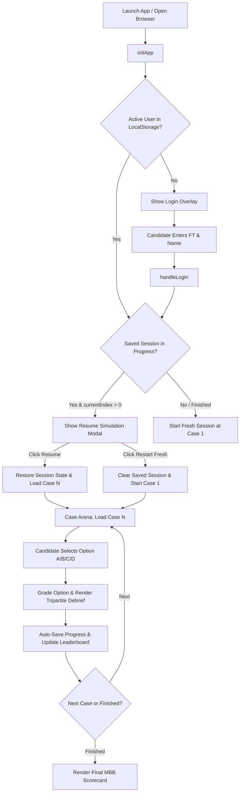

# The Strategy Boardroom — System Architecture, Workings & Finalized Logic Manual

**Application Title:** The Strategy Boardroom — Executive Case Consultant & Strategy Framework Trainer  
**Project Path:** `C:\Users\Ankit\Desktop\Strategy_Project\app2`  
**Distribution Path:** `C:\Users\Ankit\Desktop\Strategy_Project\app2\dist`  
**Deployment Target:** Standalone Client-Side Web Application (Netlify / Local Execution)  
**Version:** 2.0 (Finalized Architecture)  
**Date of Ratification:** September 2026  

---

## 1. Executive System Overview

**The Strategy Boardroom** is an interactive, gamified MBA placement and MBB (McKinsey, BCG, Bain) strategy simulation platform. It bridges theoretical academic literature with high-stakes corporate decision-making by placing candidates into **303 realistic business dilemmas** governed by **27 canonical strategic frameworks**.

### Core Technical Paradigms:
* **Zero External Dependencies:** Built with pure Vanilla HTML5, Vanilla CSS3, and Modern ES6 JavaScript. Runs 100% client-side without servers, npm packages, or build pipelines.
* **Procedural Web Audio Engine:** Generates interactive audio cues directly via the browser's Web Audio API without relying on external media files.
* **Isolated Multi-User Storage:** Partitioned `localStorage` engine allowing multiple candidates on the same browser session to maintain independent progress and scores.
* **Bi-Directional Case & Framework Linking:** Every case dilemma links dynamically to its governing framework blueprint, schematics, and academic citations.

---

## 2. Directory Structure & File Manifest

```
C:\Users\Ankit\Desktop\Strategy_Project\app2/
│
├── index.html                           # Main single-page application structure & modals
├── styles.css                           # Obsidian Dark Luxury design system & animations
├── app.js                               # Master simulation state machine & audio synthesis
├── frameworks.js                        # 27 canonical strategic framework blueprints
├── cases.js                             # 303 curated strategy case dilemmas with debriefs
├── Launch_Strategy_Boardroom.bat        # 1-Click offline desktop launcher
├── executive_admin_access.md            # Administrator credentials & instructions
├── Strategic_Boardroom_Game_Manual.md   # Candidate game manual and case handbook
└── dist/                                # Packaged production distribution folder
```

---

## 3. Master Data Models & Schemas

### A. Case Dilemma Model (`cases.js` -> `CASES_DATA`)
Each case in the 303-question corpus conforms to the following schema:

```javascript
{
  "id": 1,                                  // Unique case integer (1 to 303)
  "title": "The Low-Cost Sky Duel",         // Case title
  "track": "consulting",                   // Track: 'consulting' | 'tech-pm' | 'fmcg-brand' | 'gen-man'
  "sector": "Aviation / Transportation",    // Industry vertical
  "company": "IndiGo Airlines",             // Enterprise / Scenario context
  "context": "Executive scenario text...",  // Problem statement & operational constraints
  "prompt": "Consultant decision query...", // Lead prompt for candidate
  "options": [
    {
      "id": "A",                           // Option letter (A, B, C, D)
      "text": "Recommendation description...",
      "isCorrect": true,                   // Exactly one top-tier option per case
      "justification": "Consultant Action Justification (Why this move wins)...",
      "frameworkBreakdown": "Governing framework theoretical explanation...",
      "frameworkUtilization": "Step-by-step application mechanics...",
      "boundaryTrap": "Fatal Boundary Trap & Novice Anti-Pattern avoided...",
      "frameworkSlug": "fw-06"             // Link to canonical framework
    }
    // Options B, C, D (Sub-optimal or fatal anti-patterns)
  ]
}
```

### B. Strategic Framework Model (`frameworks.js` -> `FRAMEWORKS`)
The 27 framework blueprints adhere to the following 5-point structure:

```javascript
{
  "id": 1,                                  // Unique framework integer (1 to 27)
  "slug": "fw-01",                          // URL/Reference slug
  "title": "RISE: Research → Insight → Strategy → Execution",
  "subtitle": "A disciplined planning cycle from data to action",
  "part": "Part I — Business Strategy",     // Academic category
  "desc": "Full theoretical definition...",// Conceptual mechanics
  "schematic": "How to read the visual...", // Visual blueprint guide
  "examples": "1. Dove Real Beauty...",     // Concrete corporate case studies
  "when_use": "• Annual marketing plan...", // Sweet spot decision scenarios
  "when_not": "• Fast, reversible moves...",// Boundary traps & failure modes
  "sources": "• Smith (1998)..."            // Canonical academic citations
}
```

---

## 4. Master Application State & Lifecycle Machine

The runtime state is managed via the global `gameState` object in `app.js`:

```javascript
let gameState = {
  user: null,               // Active candidate profile { ftNumber, fullName, isAdmin }
  activeTrack: 'all',       // Active track filter ('all', 'consulting', 'tech-pm', etc.)
  currentIndex: 0,          // Active case pointer (0 to 302)
  filteredCases: [],        // Permuted cases array for the active track
  score: 0,                 // Total correct recommendations in active session
  streak: 0,                // Current unbroken winning streak
  bestStreak: 0,            // Highest streak achieved in the active session
  answered: false,          // Boolean lock preventing multi-click grading exploits
  activeFrameworkId: 1,     // Framework ID governing current active case
  audioCtx: null            // Web Audio API context
};
```

---

## 5. Core Operational Workings & Finalized Logics



### A. Authentication & Permission Logic (`handleLogin`, `checkIsAdmin`)
* **Standard Candidates:** Enter any valid `FT Number` (e.g., `FT240123` or `240123`) and `Full Name`. Cleaned to uppercase alphanumeric strings.
* **Admin Role Detection:** Evaluated dynamically via `checkIsAdmin(cleanFt, rawName)`:
  * Admin criteria: `cleanFt === 'FT271049'` OR name contains `'Ankit Agrawal'`, `'ANKIT'`, or `'ANKIT_ADMIN'`.
  * **Admin Privileges Unlocked:**
    1. Top navigation reveals the `👑 Admin Panel` button.
    2. Leaderboard reveals privileged action toolbar: `📊 Export CSV`, `📥 Export JSON`, and `🗑️ Reset Leaderboard`.

### B. Multi-User Session Isolation Engine
To prevent shared-computer score bleed:
1. **Isolated Storage Keys:** Session data is persisted under `StrategyBoardroom_UserSession_[FT_NUMBER]`.
2. **Session Decoupling:** Logging out (`handleLogout()`) clears the active user, wipes in-memory score registers (`score = 0`, `streak = 0`, `currentIndex = 0`), and renders the login overlay.
3. **Restoration upon Return:** Logging in loads *only* that candidate's personal session data without touching any other player's progress.

### C. Save & Resume Simulation Engine
* **Manual Save Button:** Clicking `💾 Save Progress` triggers `handleManualSave()`, saving the active case pointer, score, streak, and track, and displays a floating visual toast notification (*"Progress Saved: Case 45 of 303"*).
* **Background Auto-Save:** Every answer selection in `selectOption()` automatically executes `saveUserSession()` in the background.
* **Resume Modal Workflow (`promptResumeModal`):**
  * When a candidate with an active session (`currentIndex > 0`) logs in or refreshes, the app opens the **Resume Strategy Simulation** dialog.
  * Displays: *Resuming Case Number*, *Current Score Ratio*, *Accuracy %*, and *Best Streak*.
  * **Option 1 (`confirmResumeSession`):** Restores state and jumps to the exact case.
  * **Option 2 (`confirmRestartFresh`):** Clears the in-progress session and starts cleanly from Case 1 without deleting the candidate from historical leaderboard rankings.

### D. Randomized Option Shuffling (Anti-Bias Logic)
To eliminate answer positioning bias:
1. **Dataset Balancing:** The master dataset in `cases.js` is distributed across all 4 option positions:
   * **Option A:** ~24.4% (74 cases)
   * **Option B:** ~23.8% (72 cases)
   * **Option C:** ~26.1% (79 cases)
   * **Option D:** ~25.7% (78 cases)
2. **Dynamic Runtime Shuffling (`loadCase`):**
   * Every time a case loads, `c.options` is passed through a **Fisher-Yates random shuffle**.
   * Badges are dynamically re-indexed to `A`, `B`, `C`, `D`.
   * Feedback labels (e.g., *"Best Move: Option C"*) dynamically bind to the randomized letter assignment.

### E. Question Evaluation & Tripartite Debriefing (`selectOption`)
When an option is clicked:
1. **Locking Mechanism:** `gameState.answered = true` prevents duplicate scoring or double-clicking.
2. **Visual Highlighting:**
   * Correct option is outlined in glowing **Emerald Green** (`#10b981`).
   * Incorrect chosen option is highlighted in **Crimson Red** (`#f43f5e`).
3. **Score & Streak Update:**
   * **Correct:** Score increments (`score++`), streak increments (`streak++`), and plays high-register Web Audio success chime (`523Hz → 659Hz → 783Hz`).
   * **Incorrect:** Streak resets (`streak = 0`), score remains unchanged, and plays low-register sawtooth buzzer (`160Hz → 110Hz`).
4. **Debrief Display:** Renders the 3 pedagogical debrief blocks:
   * 💡 **1. Consultant Action Justification**
   * 🏛️ **2. Strategic Framework Utilization**
   * ⚠️ **3. Fatal Boundary Trap & Novice Anti-Pattern Avoided**

---

## 6. The 27 Framework Arsenal & Visual Rendering Engine

All 27 frameworks defined in `frameworks.js` are equipped with custom CSS/HTML interactive visual components generated via `renderFrameworkVisual(fw)` in `app.js`:

| ID | Framework Name | Visual Schematic Type | Core Decision Leverage |
| :---: | :--- | :--- | :--- |
| **01** | **RISE Planning Cycle** | 4-Stage Gate Process Flow | Research $\rightarrow$ Insight $\rightarrow$ Strategy $\rightarrow$ Execution |
| **02** | **PESTEL Analysis** | 6-Segment Hexagonal Matrix | Political, Economic, Social, Tech, Envir, Legal |
| **03** | **SWOT / TOWS Matrix** | 2×2 Internal/External Grid | SO, WO, ST, WT strategic pairing |
| **04** | **Porter's Five Forces** | 5-Vector Structural Pressure Box | Rivalry, Entrants, Suppliers, Buyers, Substitutes |
| **05** | **Porter's Value Chain** | Primary Horizontal + Support Rows | Activity disaggregation to Margin |
| **06** | **Porter's Generic Strategies** | 2×2 Scope vs Source Matrix | Cost Leadership, Differentiation + Stuck-in-Middle trap |
| **07** | **VRIO Framework** | 4-Gate Sequential Stepped Tree | Valuable $\rightarrow$ Rare $\rightarrow$ Inimitable $\rightarrow$ Organised |
| **08** | **Core Competence** | 3-Tier Tree Roots Architecture | Roots (Competence) $\rightarrow$ Core Products $\rightarrow$ End Goods |
| **09** | **BCG Growth–Share Matrix** | 2×2 Growth vs Share Matrix | Stars, Cash Cows, Question Marks, Dogs |
| **10** | **GE–McKinsey Nine-Box** | 3×3 Industry vs Strength Matrix | Grow/Invest, Hold/Select, Harvest/Exit |
| **11** | **Ansoff Growth Matrix** | 2×2 Market vs Product Grid | Penetration, Market Dev, Product Dev, Diversification |
| **12** | **RASCI Matrix** | 5-Role Responsibility Grid | Responsible, Accountable (Single 'A' Rule), Support, Consult, Inform |
| **13** | **Marketing Mix (4Ps / 7Ps)** | 4Ps Grid + 3Ps Service Extension | Product, Price, Place, Promotion (+ People, Process, Physical) |
| **14** | **4Cs Customer-Centric Mix** | 4-Row Outside-In Translation Matrix | Product $\rightarrow$ Value, Price $\rightarrow$ Cost, Place $\rightarrow$ Conv, Promo $\rightarrow$ Comm |
| **15** | **STP Framework** | 3-Stage Funnel Flow + Formula | Segmentation $\rightarrow$ Targeting $\rightarrow$ Positioning Formula |
| **16** | **Perceptual / Positioning Maps**| 2-Axis Coordinate Spatial Map | Price vs Quality with Whitespace Bubble & Repositioning |
| **17** | **Product Life Cycle (PLC)** | 4-Stage Timeline Progression | Intro $\rightarrow$ Growth $\rightarrow$ Maturity $\rightarrow$ Decline (Profit Lead-Lag) |
| **18** | **Kano Satisfaction Model** | 2×2 Quadrant Matrix + Decay | Must-Be, Performance, Delighters (Dynamic decay) |
| **19** | **Customer Journey & AIDA** | 4-Tier Funnel + Flywheel Loop | Attention $\rightarrow$ Interest $\rightarrow$ Desire $\rightarrow$ Action + Loyalty Loop |
| **20** | **TAM / SAM / SOM** | 3 Concentric Nested Circles | Total Market $\rightarrow$ Serviceable Market $\rightarrow$ Obtainable Market |
| **21** | **Product–Market Fit** | Dual Retention Curve Comparison | True PMF (Flattening Curve) vs False PMF (Decay to 0) |
| **22** | **Crossing the Chasm** | Adoption Bell Curve + Chasm Gap | Early Adopters $\rightarrow$ [CHASM] $\rightarrow$ Early Majority via Beachhead |
| **23** | **Diffusion of Innovations** | 5-Segment Rogers Distribution | Innovators (2.5%), Early Adopt (13.5%), Majority (68%), Laggards (16%) |
| **24** | **Business Model Canvas** | 9-Block Osterwalder Architecture | Partners, Activities, Resources, Value, Relations, Channels, Segments, Cost, Rev |
| **25** | **Lean Startup (BML Loop)** | Circular Feedback Loop | Build (MVP) $\rightarrow$ Measure (Data) $\rightarrow$ Learn (Pivot/Persevere) |
| **26** | **Blue Ocean ERRC Grid** | 4-Action Value Innovation Grid | Eliminate, Reduce, Raise, Create (Value Innovation) |
| **27** | **Diversification Matrix** | 2×2 Integration + Voids Filter | Horizontal, Vertical, Related, Unrelated + Institutional Voids |

---

## 7. Scoring, Accuracy & MBB Placement Algorithm

### A. Accuracy & Precision Formulation
$$\text{Strategic Accuracy (\%)} = \text{round}\left( \frac{\text{Correct Recommendations}}{\text{Total Cases Attempted}} \times 100 \right)$$

### B. MBB Placement Verdict Tiers (`showResults`)
At simulation completion, the candidate's strategic acumen is graded against standardized MBB consulting placement benchmarks:

```
┌─────────────────┬────────────────────────────────────────────────────────┐
│ Accuracy Range  │ Official MBB Placement Verdict                         │
├─────────────────┼────────────────────────────────────────────────────────┤
│ 90% – 100%      │ 🏆 MBB PARTNER OFFER / TOP-TIER STRATEGIC CONSULTANT    │
│ 75% – 89%       │ 💼 SENIOR ENGAGEMENT MANAGER / STRONG CANDIDATE        │
│ 50% – 74%       │ 📈 ASSOCIATE CONSULTANT / SOLID FOUNDATION             │
│ < 50%           │ 📚 JUNIOR ANALYST / FRAMEWORK REVISION NEEDED          │
└─────────────────┴────────────────────────────────────────────────────────┘
```

---

## 8. Leaderboard & Data Export Engines

### A. Leaderboard Storage Schema (`StrategyBoardroom_Leaderboard_v11`)
Persisted as a JSON array of participant performance records:

```json
[
  {
    "ftNumber": "FT271049",
    "fullName": "Ankit Agrawal",
    "correct": 18,
    "attempted": 20,
    "scoreRatio": "18 / 20",
    "accuracy": "90%",
    "bestStreak": 8,
    "date": "02 Sep 2026"
  }
]
```

### B. RFC-4180 CSV Export Engine (`exportScoresCSV`)
* **Encoding:** Includes UTF-8 Byte Order Mark (`\uFEFF`) ensuring Microsoft Excel, Apple Numbers, and Google Sheets parse accented and special characters without corruption.
* **Escaping:** Values with commas or quotations are wrapped in RFC-4180 escaped double quotes (`""`).
* **Header Structure:** `Rank, Candidate Name, FT Number, Score Ratio, Correct, Attempted, Accuracy, Best Streak, Date & Time`.
* **Download Filename:** `Strategy_Boardroom_Leaderboard_YYYY-MM-DD.csv`.

### C. JSON Export Engine (`exportScores`)
* Downloads raw database state as formatted JSON: `Strategy_Boardroom_Leaderboard_YYYY-MM-DD.json`.

### D. Administrative Reset Engine (`clearScores`)
* Purges the entire cohort database from `localStorage` upon explicit confirmation.

---

## 9. Procedural Web Audio Engine

Sound effects are synthesized dynamically without external `.mp3` or `.wav` dependencies:

```javascript
const sound = {
  ctx: null,
  init() { /* Creates AudioContext on first user gesture */ },
  click() {
    // 800Hz Sine wave, 0.05s pulse
  },
  correct() {
    // 3-Tone Ascending Major Triad (C5: 523Hz → E5: 659Hz → G5: 784Hz)
  },
  wrong() {
    // Descending Sawtooth Tone (160Hz → 110Hz, 0.3s)
  }
};
```

---

## 10. Verification & Quality Assurance Protocols

1. **DOM ID Binding:** 100% parity across `index.html` elements and `app.js` event listeners.
2. **Option Balance:** Verified single correct option per case across all 303 cases.
3. **Framework Linkages:** 100% of cases resolve directly to a valid framework ID (1 to 27) without fallback mismatches.
4. **Offline Resilience:** All scripts, fonts, and assets gracefully run offline with local fallbacks.

---

*This document represents the finalized technical, architectural, and pedagogical standard for **The Strategy Boardroom**.*
